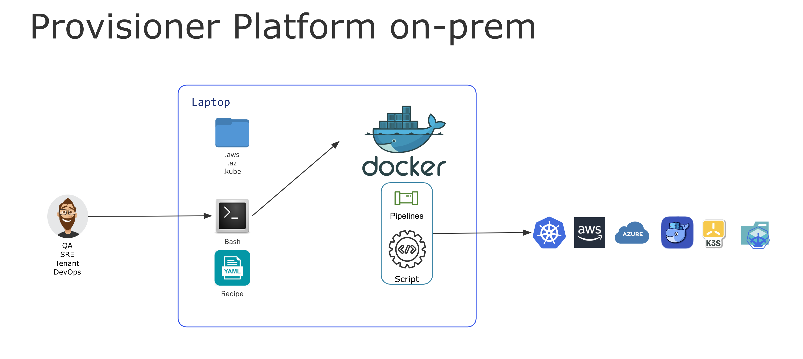
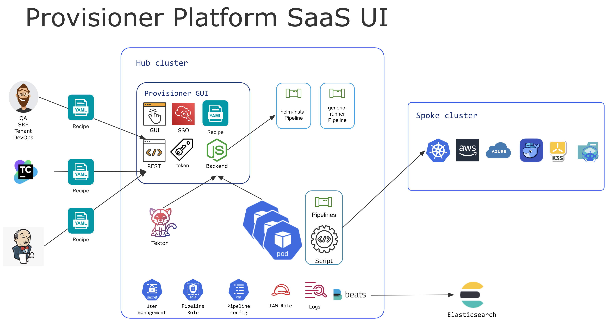

# Platform Provisioner Design

## Overview

The Platform Provisioner is designed to fit both on-prem and cloud environments. It has a headless mode to run in a Docker container.
And it also has a UI mode to run as a SaaS service. In the core; it uses the same pipeline and recipe to provision the platform infrastructure and applications.

## What is the pipeline and recipe? 

The recipe is a YAML file that contains all the information to provision a platform infrastructure and applications. 
The schema of recipe is based on the kind of pipeline that the user wants to run. The platform provisioner use cue to validate the recipe schema.
There is a common schema for all the pipelines ([shared.cue](../../charts/common-dependency/scripts/shared.cue)) and a specific schema for each pipeline.
* For the `generic-runner` pipeline, the recipe contains the steps to run the shell scripts. 
  * The schema is defined in the [check.cue](../../charts/generic-runner/scripts/check.cue)
  * `generic-runner` pipeline is fit to run the shell scripts and use tools inside docker container.
* For the `helm-install` pipeline, the recipe contains the helm chart and values to install the application.
  * The schema is defined in the [check.cue](../../charts/helm-install/scripts/check.cue)
  * `helm-install` pipeline is fit to install the helm chart and values to the kubernetes cluster.

For more information see: [pipelines.md](pipelines.md)

## Run with headless mode

This mode is designed for the case where the user wants to run the platform-provisioner with minimal dependencies. User only need to install Docker and Bash shell. 
All the tools and dependencies are packaged in the Docker image. It is more for the on-prem use case. User needs to use the recipe to install a full cloud native platform on the on-prem environment.



### Prerequisite
* Docker installed
* Bash shell

### Run the Platform Provisioner

Assuming we want to use the recipe to test the connectivity to the local kubernetes cluster. (Docker Desktop Kubernetes, minikube, kind, etc.)
Make sure the default kubeconfig (~/.kube/config) is pointing to the local kubernetes cluster.

Go to the project root directory and run the following command.
```bash
export PIPELINE_INPUT_RECIPE="docs/recipes/tests/test-local.yaml"
./dev/platform-provisioner.sh
```

The above command will run the scripts defined on the recipe `docs/recipes/tests/test-local.yaml` with the pipeline `generic-runner` inside the Docker container `ghcr.io/tibcosoftware/platform-provisioner/platform-provisioner:latest`.

This is fully customizable and can be extended to fit your needs.  Ideally user can create different recipes for different use cases.

## Run with UI mode

This mode is designed for the case where the user wants to run the platform-provisioner as a SaaS service or use the UI to edit the recipe and deploy the platform.



### Prerequisite
* Docker installed
* Bash shell
* A local or remote Kubernetes cluster
* kubectl installed
* Helm installed

### Deploy the Platform Provisioner UI

Assuming we want to deploy the platform-provisioner UI as a LoadBalancer service on the local Kubernetes cluster. 
(Prefer to use Docker Desktop Kubernetes; for other Kubernetes clusters, use the appropriate service type.)

Go to the project root directory and run the following command.
```bash
export PIPELINE_GUI_SERVICE_PORT=8080
export PIPELINE_GUI_SERVICE_TYPE=LoadBalancer
./dev/platform-provisioner-install.sh
```
