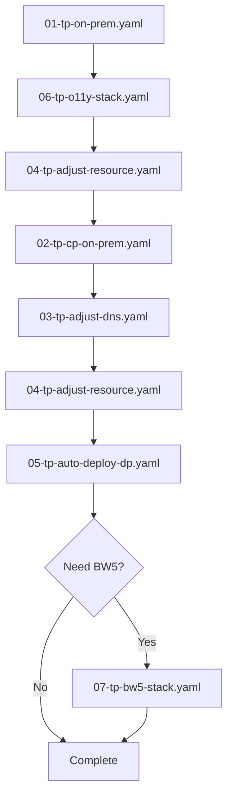

# Generated Recipe Files Reference

## Overview

This document provides detailed information about the recipe files generated by the `generate-recipe.sh` script. These recipes automate the deployment of TIBCO Platform on-premises environments.

### Recipe Generation Process

The recipes are extracted from the `provisioner-config-local` Helm chart using the `generate-recipe.sh` script. The script:

1. Pulls recipe templates from the Helm chart (either from public repo or local development)
2. Processes the templates using `yq` and `helm template`
3. Generates 1-7 YAML recipe files depending on the selected option
4. Configures environment-specific settings for your Kubernetes cluster

**Source Location**: `charts/provisioner-config-local/config/`

### Recipe Execution

Recipes are executed using the `run.sh` script or individually via the Platform Provisioner pipeline:

```bash
# Execute a single recipe
export PIPELINE_INPUT_RECIPE="01-tp-on-prem.yaml"
./dev/platform-provisioner.sh
```

---

## Recipe Files

### 01-tp-on-prem.yaml - On-Premises Infrastructure

**Source Template**: `pp-deploy-tp-base-on-prem-cert.yaml`
**Pipeline Type**: `helm-install`
**Execution Order**: First (prerequisite for all other recipes)

#### Purpose

Deploys the foundational infrastructure required for TIBCO Platform on-premises:
- **Ingress Controller**: nginx or Traefik for routing external traffic
- **PostgreSQL Database**: Database backend for Control Plane
- **Certificate Management**: TLS certificates for secure communication
- **Storage Provisioner**: Optional NFS server for ReadWriteMany storage
- **Platform Provisioner UI**: Web interface for recipe management

#### What Gets Deployed

| Component | Namespace | Description |
|-----------|-----------|-------------|
| Ingress Controller | `ingress-system` | nginx or Traefik (LoadBalancer service type) |
| PostgreSQL | `tibco-ext` | PostgreSQL database pod with persistent storage |
| Cert-Manager | `cert-manager` | Certificate management and self-signed CA |
| NFS Provisioner | `nfs-system` | Optional NFS server for shared storage |
| Provisioner UI | Various | Web UI for managing recipes and automation |

#### Key Configuration

- **Domain**: `*.localhost.dataplanes.pro` (resolves to `127.0.0.1`)
- **Storage Classes**:
  - Docker Desktop: `hostpath`
  - minikube: `standard`
  - kind: `standard` (no ReadWriteMany support)
  - MicroK8s: `microk8s-hostpath`
  - OpenShift: `crc-csi-hostpath-provisioner`
  - NFS: `nfs` (when NFS provisioner is enabled)
- **Database**: PostgreSQL pod with default credentials
- **Container Registry**: TIBCO jFrog registry (requires credentials)

#### Prerequisites

- Running Kubernetes cluster
- kubectl configured with cluster access
- Container registry credentials (jFrog username/password)

#### Outputs

- Ingress accessible at configured domain
- PostgreSQL ready for CP installation
- Storage classes available for persistent volumes
- Platform Provisioner UI at `https://provisioner.localhost.dataplanes.pro`

#### Environment-Specific Notes

- **ReadWriteMany Support**: kind and OpenShift require NFS provisioner for shared storage
- **Service Type**: Only ONE LoadBalancer service allowed per on-prem cluster
- **Certificate**: Self-signed certificates are created by default

---

### 02-tp-cp-on-prem.yaml - Control Plane Deployment

**Source Template**: `pp-deploy-cp-core-on-prem.yaml`
**Pipeline Type**: `helm-install`
**Execution Order**: Second (after infrastructure)

#### Purpose

Deploys the TIBCO Platform Control Plane, the central management layer that orchestrates Data Planes, subscriptions, users, and capabilities.

#### What Gets Deployed

The recipe deploys multiple Helm charts to install a complete Control Plane with all capabilities:

| Helm Chart | Release Name | Namespace | Description |
|------------|--------------|-----------|-------------|
| **tibco-cp-base** | platform-base | `cp1-ns` | Core CP platform (router, hybrid-proxy, orchestrator, identity management, web server, etc.) |
| **tibco-cp-bw** | tibco-cp-bw | `cp1-ns` | BusinessWorks integration capabilities and recipes |
| **tibco-cp-flogo** | tibco-cp-flogo | `cp1-ns` | Flogo integration capabilities and utilities |
| **tibco-cp-devhub** | tibco-cp-devhub | `cp1-ns` | TIBCO Developer Hub (TIBCOHub) for connectors and contributions |
| **tibco-cp-messaging** | tibco-cp-messaging | `cp1-ns` | Messaging platform for event-driven integration |
| **tibco-cp-hawk** | tibco-cp-hawk | `cp1-ns` | Hawk monitoring and management platform |
| **tibco-cp-addon-eventprocessing** | tibco-cp-addon-eventprocessing | `cp1-ns` | Event processing addon for streaming analytics |
| **tibco-cp-ai-agent** | tibco-cp-ai-agent | `cp1-ns` | AI Agent platform (optional, disabled by default) |
| **MailDev** | maildev | `tibco-ext` | Email server for admin registration (development only) |

**Core Services in tibco-cp-base:**
- **Router Operator**: Service routing and API gateway
- **Hybrid Proxy**: Tunnel connection for hybrid cloud deployments
- **Resource Set Operator**: Kubernetes resource management
- **TP CP Core**: Admin web server, orchestrator, identity provider, email service, user subscriptions, pengine
- **TP CP Infra**: Compute services and infrastructure components
- **TP CP FinOps**: Financial operations and monitoring services
- **TP CP O11y**: Observability integration and MCP servers
- **OTel Collector**: OpenTelemetry collector for logs and traces (if logging enabled)

#### Key Configuration

- **CP Chart Repository**: TIBCO public or private Helm repository
- **CP Version**: Configurable via recipe (see TIBCO Platform version matrix)
- **Database Connection**: Uses PostgreSQL deployed in recipe 01
- **Email Server**: MailDev for local development
  - MailDev UI: `https://mail.localhost.dataplanes.pro`
  - Admin registration email sent here
- **Ingress**: CP services exposed via ingress controller
- **Storage**: Uses storage classes from recipe 01

#### Prerequisites

- Recipe 01 completed (infrastructure deployed)
- PostgreSQL database running
- Ingress controller available
- Valid container registry credentials

#### Configuration Options

The recipe provides extensive configuration options via environment variables:

**Chart Versions** (lines 34-41):
- `GUI_CP_PLATFORM_TIBCO_CP_BASE_VERSION`: Core platform version (default: 1.14.0)
- `GUI_CP_PLATFORM_INTEGRATION_BW_VERSION`: BusinessWorks version (default: 1.14.0)
- `GUI_CP_PLATFORM_INTEGRATION_FLOGO_VERSION`: Flogo version (default: 1.14.0)
- `GUI_CP_PLATFORM_TIBCOHUB_VERSION`: DevHub version (default: 1.14.0)
- `GUI_CP_PLATFORM_MESSAGING_VERSION`: Messaging version (default: 1.13.15)
- `GUI_CP_PLATFORM_HAWK_VERSION`: Hawk version (default: 1.14.4)
- `GUI_CP_PLATFORM_EVENTPROCESSING_VERSION`: Event processing version (default: 1.12.0)
- `GUI_CP_PLATFORM_AI_AGENT_VERSION`: AI Agent version (default: ~1.14.0-0)

**Control Plane Instance** (lines 44-52):
- `GUI_CP_INSTANCE_ID`: CP instance identifier (default: cp1)
- `GUI_CP_NAMESPACE`: Kubernetes namespace (default: cp1-ns)
- `GUI_CP_ADMIN_EMAIL`: Admin email address
- `GUI_CP_EXTERNAL_ENVIRONMENT`: Environment type (production/staging)
- `GUI_CP_GLOBAL_USE_SINGLE_NAMESPACE`: Use single namespace for all CP components

**AI/MCP Servers** (lines 54-58):
- `GUI_TP_AI_ENABLE_CP_MCP_SERVER`: Enable Control Plane MCP server
- `GUI_TP_AI_ENABLE_O11Y_MCP_SERVER`: Enable Observability MCP server
- `GUI_TP_AI_ENABLE_BW_MCP_SERVER`: Enable BusinessWorks MCP server
- `GUI_TP_AI_ENABLE_FLOGO_MCP_SERVER`: Enable Flogo MCP server

**Flow Control** (lines 121-135):
- `GUI_CP_INSTALL_TIBCO_CP_BASE`: Install core CP platform (default: true)
- `GUI_CP_INSTALL_PLATFORM_INTEGRATION_BW`: Install BusinessWorks (default: true)
- `GUI_CP_INSTALL_PLATFORM_INTEGRATION_FLOGO`: Install Flogo (default: true)
- `GUI_CP_INSTALL_PLATFORM_TIBCOHUB`: Install DevHub (default: true)
- `GUI_CP_INSTALL_PLATFORM_MESSAGING`: Install Messaging (default: true)
- `GUI_CP_INSTALL_PLATFORM_HAWK`: Install Hawk (default: true)
- `GUI_CP_INSTALL_PLATFORM_EVENTPROCESSING`: Install Event Processing (default: true)
- `GUI_CP_INSTALL_PLATFORM_AI_AGENT`: Install AI Agent (default: false)

#### Outputs

- Control Plane running in `cp1-ns` namespace (configurable via `GUI_CP_NAMESPACE`)
- All CP capability charts deployed (BW, Flogo, DevHub, Messaging, Hawk, Event Processing)
- CP Web UI accessible via router ingress at `https://cp1-my.localhost.dataplanes.pro`
- MailDev inbox with admin registration email at `https://mail.localhost.dataplanes.pro`
- Router and Hybrid Proxy services ready for DP connections
- Ready to create subscriptions and deploy Data Planes

#### Post-Deployment Steps

1. Access MailDev at `https://mail.localhost.dataplanes.pro`
2. Find the admin registration email
3. Follow the link to set admin password
4. Log into CP Web UI

#### Version Compatibility

Refer to TIBCO Platform Control Plane documentation:
- [Helm Chart Version Matrix](https://docs.tibco.com/pub/platform-cp/1.5.1/doc/html/Default.htm#Installation/helm-chart-version-matrix.htm)
- [Configuration Reference](https://docs.tibco.com/pub/platform-cp/1.5.1/doc/html/Default.htm#Installation/configuration-reference.htm)

---

### 03-tp-adjust-dns.yaml - DNS Configuration

**Source Template**: `pp-maintain-tp-config-coredns.yaml`
**Pipeline Type**: `generic-runner`
**Execution Order**: After CP deployment

#### Purpose

Configures CoreDNS in the Kubernetes cluster to rewrite the `*.localhost.dataplanes.pro` domain to the ingress controller service. This enables local DNS resolution without modifying `/etc/hosts`.

#### What It Does

1. Adds a rewrite rule to CoreDNS Corefile
2. Rewrites `*.localhost.dataplanes.pro` to ingress service:
   - **nginx**: `ingress-nginx-controller.ingress-system.svc.cluster.local`
   - **Traefik**: `traefik.ingress-system.svc.cluster.local`
3. Restarts CoreDNS pods to apply changes

#### Technical Details

- **Idempotent**: Safe to run multiple times (only adds rule if missing)
- **Base64 Encoding**: Uses base64-encoded regex pattern to avoid escape character issues
- **Regex Pattern**: `(.*)\.localhost\.dataplanes\.pro`

#### Prerequisites

- Ingress controller deployed (from recipe 01)
- CoreDNS running in cluster (default in most Kubernetes distributions)

#### Configuration

Edit the recipe to specify:
- Target ingress service name
- DNS regex pattern (base64 encoded)

#### Outputs

- CoreDNS configured with rewrite rule
- `*.localhost.dataplanes.pro` resolves to ingress controller
- Services accessible via friendly domain names

#### When to Use

- **Required for**: Local development with domain-based routing
- **Optional for**: Clusters with external DNS or `/etc/hosts` configuration
- **Helpful when**: Testing multiple services with different subdomains

#### Verification

```bash
# Check CoreDNS configmap
kubectl get configmap coredns -n kube-system -o yaml

# Test DNS resolution from a pod
kubectl run -it --rm debug --image=busybox --restart=Never -- nslookup provisioner.localhost.dataplanes.pro
```

---

### 04-tp-adjust-resource.yaml - Resource Optimization

**Source Template**: `pp-maintain-tp-remove-resource.yaml`
**Pipeline Type**: `generic-runner`
**Execution Order**: After infrastructure/CP deployment (can run multiple times)

#### Purpose

Removes resource requests and limits from all Deployments and StatefulSets in the TIBCO Platform namespaces. This is essential for local development environments with limited resources (e.g., Docker Desktop with 8GB RAM).

#### What It Does

1. **Remove Resources**: Strips `resources` sections from all containers and init containers
2. **Show Resources**: Optionally displays current resource settings before removal
3. **Adjust HPA**: Sets `maxReplicas: 1` for all HorizontalPodAutoscalers to prevent scaling

#### Affected Resources

- All Deployments in TP namespaces (`tibco-platform`, `tibco-ext`, etc.)
- All StatefulSets in TP namespaces
- All containers and init containers within these workloads
- All HorizontalPodAutoscalers

#### Prerequisites

- Control Plane or infrastructure deployed
- `kubectl` access to the cluster

#### Configuration Options

Edit the recipe to enable/disable tasks:
- `GUI_TASK_REMOVE_RESOURCES`: Remove resource limits (default: true)
- `GUI_TASK_SHOW_RESOURCES`: Display resources before removal (default: false)
- `GUI_TASK_HAP_SET_MAX_REPLICAS`: Set HPA max replicas to 1 (default: true)
- `GUI_PIPELINE_LOG_DEBUG`: Enable debug logging (default: false)

#### Safety and Idempotency

- **Idempotent**: Safe to run multiple times
- **Non-destructive**: Only removes resource constraints, doesn't affect functionality
- **Reversible**: Re-deploying resources with Helm will restore original limits

#### Outputs

- Pods restart with no resource requests/limits
- Lower memory/CPU requirements for local development
- HPA scaling limited to 1 replica

#### When to Use

- **Local Development**: Always run for Docker Desktop, minikube, kind
- **Production**: DO NOT run in production environments
- **CI/CD**: Useful for resource-constrained test environments

#### Resource Impact

Typical savings for full TP deployment:
- **Before**: 32GB+ RAM required
- **After**: 16GB RAM sufficient for basic CP + DP

#### Verification

```bash
# Check resources are removed
kubectl get deployment -n tibco-platform -o json | jq '.items[].spec.template.spec.containers[].resources'

# Check HPA max replicas
kubectl get hpa -n tibco-platform
```

---

### 05-tp-auto-deploy-dp.yaml - Data Plane Automation

**Source Template**: `pp-maintain-tp-automation-o11y.yaml`
**Pipeline Type**: `generic-runner`
**Execution Order**: After CP deployment and admin user creation

#### Purpose

Automates the complete Data Plane lifecycle including user setup, subscription creation, DP deployment, and capability configuration. This is the most complex recipe, orchestrating multiple operations via Python automation scripts.

#### What It Does

1. **User Setup**:
   - Adjusts admin user permissions if necessary
   - Configures subscription user credentials
2. **Subscription Creation**:
   - Creates a new CP subscription
   - Associates with specified user
3. **Data Plane Deployment**:
   - Deploys a new DP in the subscription
   - Configures DP networking and storage
4. **Capability Configuration**:
   - Registers capabilities with the DP
   - Configures observability (O11y) integration
   - Sets up monitoring and logging

#### Automation Script Source

The recipe can use automation scripts from:
- **GitHub** (default): Latest released automation scripts
- **Local** (development): Mount local automation code for testing
  - Local path: `../tp-setup/bootstrap/`
  - Configure via: `GUI_TP_AUTO_USE_LOCAL_SCRIPT=true`

#### Prerequisites

- Recipe 02 completed (CP deployed)
- Admin user registered and password set
- Recipe 06 completed if O11y integration is required
- GitHub token for private chart repositories (if using private charts)
- Activation server configured (for licensed capabilities)

#### Key Configuration

| Setting | Description | Required |
|---------|-------------|----------|
| `GUI_GITHUB_TOKEN` | GitHub personal access token | Yes (for private repos) |
| `GUI_TP_AUTO_ACTIVE_USER` | Activation server user | Yes (for licensing) |
| DP hostname prefix | Subdomain for DP services | Yes |
| Username/Password | DP subscription user credentials | Yes |
| Activation server settings | IP, port, fingerprint | For licensed features |

#### Execution Flow

```
1. Validate CP is running
2. Authenticate with admin credentials
3. Create subscription user (if needed)
4. Create subscription
5. Deploy Data Plane
6. Wait for DP readiness
7. Register capabilities
8. Configure O11y integration
9. Verify deployment
```

#### Outputs

- New subscription created in CP
- Data Plane deployed and running
- Capabilities registered and available
- O11y integration configured (if stack deployed)
- DP accessible via `https://{prefix}.localhost.dataplanes.pro`

#### Retry Logic

The `run.sh` script executes this recipe with automatic retry:
- Default retry count: 10 attempts
- Configurable via: `TP_SUBSCRIPTION_DEPLOY_RETRY_COUNT`
- 10-second delay between retries
- Handles transient failures during DP provisioning

#### Troubleshooting

**Common Issues:**
- **Timeout waiting for DP**: Increase retry count or check cluster resources
- **Authentication failures**: Verify admin credentials and user permissions
- **O11y integration fails**: Ensure recipe 06 (O11y stack) is deployed first
- **Activation errors**: Check activation server connectivity and credentials

**Debug Mode:**
```bash
# Enable debug logging
export GUI_PIPELINE_LOG_DEBUG=true
```

#### Local Development Mode

When using local automation scripts:
```bash
# In generate-recipe.sh, select option "2. Use local repo"
./generate-recipe.sh 2 1

# The recipe will be configured to mount local automation code
# Edit Python scripts in ../tp-setup/bootstrap/ and re-run
```

---

### 06-tp-o11y-stack.yaml - Observability Stack

**Source Template**: `pp-o11y-full.yaml`
**Pipeline Type**: `helm-install`
**Execution Order**: Before or after CP (recommended before for monitoring during deployment)

#### Purpose

Deploys a complete observability (O11y) stack for monitoring, logging, and tracing TIBCO Platform services. Provides visibility into application performance and system health.

#### What Gets Deployed

| Component | Namespace | Description |
|-----------|-----------|-------------|
| ECK Operator | `elastic-system` | Elastic Cloud on Kubernetes operator |
| Elasticsearch | `elastic-system` | Log and trace storage backend |
| Kibana | `elastic-system` | Log visualization and analysis UI |
| APM Server | `elastic-system` | Application Performance Monitoring |
| Prometheus | `prometheus-system` | Metrics collection and storage |
| Grafana | `prometheus-system` | Metrics visualization (optional) |
| dp-config-es | `elastic-system` | TIBCO-specific Elasticsearch index templates |

#### Architecture

```
TIBCO Platform Services
    ↓ (logs, metrics, traces)
    ├─→ Elasticsearch ← Kibana (visualization)
    ├─→ APM Server (traces)
    └─→ Prometheus ← Grafana (metrics)
```

#### Prerequisites

- Infrastructure deployed (recipe 01)
- Sufficient cluster resources:
  - **Elasticsearch**: 4GB+ RAM recommended
  - **Prometheus**: 2GB+ RAM recommended
  - Consider running recipe 04 to remove resource limits

#### Key Configuration

- **Elasticsearch**:
  - eck-operator for lifecycle management
  - dp-config-es for TIBCO index templates
  - Single-node deployment (development)
- **Prometheus**:
  - Service discovery for TP workloads
  - Metrics retention period
  - Alert rules (optional)

#### Outputs

- Elasticsearch cluster running and healthy
- Kibana UI accessible via ingress
- APM Server ready for trace ingestion
- Prometheus scraping TP metrics
- Index templates configured for TP logs

#### Integration with TP

The O11y stack integrates with:
- **Control Plane**: CP services send logs and metrics
- **Data Planes**: DP services send logs, metrics, and traces
- **Recipe 05**: Automation configures DP → O11y integration

#### Access URLs

- **Kibana**: `https://kibana.localhost.dataplanes.pro`
- **Prometheus**: `https://prometheus.localhost.dataplanes.pro`
- **Grafana**: `https://grafana.localhost.dataplanes.pro` (if deployed)

#### Troubleshooting

**Elasticsearch Pod Pending**:
```bash
# Check for storage issues
kubectl get pvc -n elastic-system

# If dp-config-es-es-default-0 is pending, try option 7 in run.sh
# This uninstalls and redeploys the O11y stack
./run.sh 7
```

**High Resource Usage**:
```bash
# Reduce Elasticsearch replicas for local development
# Or run recipe 04 to remove resource limits
```

#### Retention and Storage

- **Logs**: Default retention in Elasticsearch (typically 7-30 days)
- **Metrics**: Prometheus retention (default 15 days)
- **Storage Requirements**: 20GB+ recommended for persistent volumes

---

### 07-tp-bw5-stack.yaml - BusinessWorks 5 Stack

**Source Template**: `pp-maintain-tp-deploy-bw5dm.yaml`
**Pipeline Type**: `helm-install`
**Execution Order**: After CP deployment (optional)

#### Purpose

Deploys the BusinessWorks 5 (BW5) integration stack for running classic TIBCO ActiveMatrix BusinessWorks applications on TIBCO Platform.

#### What Gets Deployed

| Component | Description |
|-----------|-------------|
| **RVDM** | Rendezvous Daemon Manager for messaging |
| **EMS Server** | Enterprise Message Service for JMS |
| **Hawk Console** | Application monitoring and management |
| **BW5 Runtime** | BusinessWorks 5 application runtime |

#### Prerequisites

- Recipe 02 completed (CP deployed)
- Access to TIBCO BW5 private Helm chart repository
- **Architecture**: x86_64 only (ARM64/Mac M1/M2 NOT supported)
- Valid TIBCO activation server credentials
- GitHub token for private chart access

#### Key Configuration

- **Chart Repository**:
  - Private GitHub repository for BW5 charts
  - GitHub token required for access
  - Repository URL and username
- **Activation Server**:
  - Activation server IP address
  - Hostname for license validation
  - Port (default: 8000)
  - Server fingerprint for security
- **BW5 Versions**:
  - Configurable per component
  - Must match licensed versions

#### Outputs

- BW5 runtime environment ready
- EMS Server available for messaging
- RVDM running for Rendezvous transport
- Hawk Console for monitoring BW5 apps
- Ready to deploy BW5 applications

#### Architecture Limitation

**IMPORTANT**: This recipe only works on **x86_64** architecture:
- ✅ Intel/AMD processors
- ❌ ARM64 (Apple Silicon M1/M2/M3)
- ❌ ARM-based cloud instances

If running on ARM architecture, the deployment will fail or containers won't start.

#### When to Use

- **Classic BW5 Migrations**: Moving existing BW5 apps to cloud-native platform
- **Hybrid Environments**: Running BW5 alongside modern BWCE applications
- **Development/Testing**: Local BW5 development environment
- **NOT for**: New integrations (use BWCE or Flogo instead)

#### Integration with TP

- BW5 apps deployed as capabilities in Data Planes
- Managed via Control Plane UI
- Monitored through O11y stack (recipe 06)
- Uses TP authentication and authorization

#### Troubleshooting

**Image Pull Failures**:
- Verify GitHub token has access to private repo
- Check chart repository URL and credentials

**Licensing Issues**:
- Verify activation server connectivity
- Check activation server fingerprint matches
- Ensure licenses are available for BW5

**Container Crashes on ARM**:
- This is expected behavior
- Deploy on x86_64 cluster instead

---

## Recipe Execution Order

### Recommended Sequence for Full Deployment



### Dependency Matrix

| Recipe | Depends On | Optional |
|--------|-----------|----------|
| 01 | None | No |
| 02 | 01 | No |
| 03 | 02 | Yes (for local DNS) |
| 04 | 01 or 02 | Yes (for low-resource envs) |
| 05 | 02, (06 for O11y) | No (for DP) |
| 06 | 01 | Yes |
| 07 | 02 | Yes |

---

## Common Deployment Scenarios

### Scenario 1: Minimal Control Plane Only

**Use Case**: Testing CP features without Data Planes

```bash
./generate-recipe.sh 1 1  # Generate all recipes
./run.sh 2               # Deploy infrastructure (recipe 01)
./run.sh 3               # Deploy CP (recipe 02)
```

**Result**: CP running, no DP, no O11y

---

### Scenario 2: Full Development Environment

**Use Case**: Local development with complete TP stack

```bash
./generate-recipe.sh 1 1  # Generate all recipes
./adjust-recipe.sh        # Adjust for your K8s environment
./run.sh 1                # Deploy everything (recipes 01-06)
```

**Result**: CP + DP + O11y + resource optimizations

---

### Scenario 3: CP + O11y (No DP)

**Use Case**: Control Plane with monitoring, manual DP creation

```bash
./generate-recipe.sh 1 1
./run.sh 2               # Infrastructure
./run.sh 5               # O11y stack
./run.sh 6               # Resource cleanup
./run.sh 3               # Control Plane
./run.sh 6               # Resource cleanup again
```

**Result**: CP with O11y, create DPs manually via UI

---

### Scenario 4: Add BW5 to Existing Deployment

**Use Case**: Deploy BW5 stack to already running TP

```bash
./generate-recipe.sh 1 1
./run.sh 8               # Deploy BW5 stack only
```

**Prerequisites**: CP must already be running (recipe 02 completed)

---

### Scenario 5: Local Development with Custom Automation

**Use Case**: Developing/testing automation scripts locally

```bash
./generate-recipe.sh 2 1  # Use local repo (important!)
./run.sh 2               # Infrastructure
./run.sh 5               # O11y
./run.sh 3               # CP
./run.sh 4               # DP with local automation scripts
```

**Note**: Recipe 05 will mount `../tp-setup/bootstrap/` for live code editing

---

## Troubleshooting Guide

### Recipe 01 Issues

**Problem**: Ingress controller not accessible
```bash
# Check ingress pods
kubectl get pods -n ingress-system

# Check service type
kubectl get svc -n ingress-system

# Verify DNS resolution
nslookup provisioner.localhost.dataplanes.pro
```

**Problem**: PostgreSQL won't start
```bash
# Check PVC status
kubectl get pvc -n tibco-ext

# Check storage class
kubectl get sc

# View pod logs
kubectl logs -n tibco-ext <postgres-pod-name>
```

---

### Recipe 02 Issues

**Problem**: CP pods in CrashLoopBackOff
```bash
# Check database connectivity
kubectl logs -n tibco-platform <cp-pod-name> | grep database

# Verify PostgreSQL is running
kubectl get pods -n tibco-ext

# Check resource availability
kubectl top nodes
```

**Problem**: Can't access MailDev
```bash
# Check MailDev pod
kubectl get pods -n tibco-ext | grep mail

# Check ingress
kubectl get ingress -n tibco-ext

# Verify DNS (if recipe 03 not run)
ping mail.localhost.dataplanes.pro
```

---

### Recipe 03 Issues

**Problem**: DNS rewrite not working
```bash
# Check CoreDNS configmap
kubectl get configmap coredns -n kube-system -o yaml

# Restart CoreDNS
kubectl rollout restart deployment coredns -n kube-system

# Test from pod
kubectl run -it --rm debug --image=busybox -- nslookup test.localhost.dataplanes.pro
```

---

### Recipe 04 Issues

**Problem**: Pods still showing resource limits
```bash
# Check if recipe actually ran
kubectl get deployment -n tibco-platform -o yaml | grep -A5 resources

# Run recipe again (idempotent)
./run.sh 6

# Wait for pod restarts
kubectl rollout status deployment -n tibco-platform
```

---

### Recipe 05 Issues

**Problem**: Subscription creation fails
```bash
# Enable debug logging
export GUI_PIPELINE_LOG_DEBUG=true

# Increase retry count
export TP_SUBSCRIPTION_DEPLOY_RETRY_COUNT=20

# Run with retries
./run.sh 4
```

**Problem**: DP deployment timeout
```bash
# Check cluster resources
kubectl top nodes
kubectl top pods -A

# Check DP pod status
kubectl get pods -A | grep dp

# View automation logs
kubectl logs <automation-pod-name>
```

---

### Recipe 06 Issues

**Problem**: Elasticsearch pod pending
```bash
# Most common issue - run redeploy
./run.sh 7

# Check PVC
kubectl get pvc -n elastic-system

# Check events
kubectl get events -n elastic-system --sort-by='.lastTimestamp'
```

**Problem**: High memory usage
```bash
# Remove resource limits first
./run.sh 6

# Or reduce ES replicas manually
kubectl edit elasticsearch -n elastic-system
```

---

### Recipe 07 Issues

**Problem**: BW5 containers won't start on Mac M1/M2
```bash
# Expected - x86_64 only
# Solution: Deploy on Intel-based cluster
```

**Problem**: Chart not found
```bash
# Verify GitHub token
echo $GITHUB_TOKEN

# Check chart repo access
helm repo add bw5-private <repo-url> --username <user> --password $GITHUB_TOKEN
helm search repo bw5-private
```

---

## Best Practices

### For Local Development

1. **Always run recipe 04** to remove resource limits
2. **Deploy O11y before CP** to capture all logs from the start
3. **Use local automation** (option 2) for faster iteration
4. **Keep recipes in version control** to track environment changes

### For Production-Like Testing

1. **Skip recipe 04** - keep resource limits
2. **Use public repo** (option 1) for stable automation
3. **Document any manual recipe edits** for reproducibility
4. **Test on target Kubernetes distribution** before production

### For CI/CD

1. **Use script mode** - pass options as arguments to avoid prompts
2. **Set environment variables** for non-interactive configuration
3. **Check exit codes** - all scripts return proper exit status
4. **Collect logs** - enable debug mode for troubleshooting

---

## Environment Variables

### Recipe Generation

```bash
# Chart repository for provisioner-config-local
export PIPELINE_CHART_REPO_PROVISIONER_CONFIG_LOCAL="https://tibcosoftware.github.io/platform-provisioner"

# Chart version
export PIPELINE_CHART_VERSION_PROVISIONER_CONFIG_LOCAL="^1.0.0"

# GitHub token (auto-populated in recipe 05)
export GITHUB_TOKEN="ghp_xxx"

# Activation user (auto-populated in recipe 05)
export TP_AUTO_ACTIVE_USER="user@example.com"
```

### Recipe Execution

```bash
# Kubeconfig file name
export PIPELINE_ON_PREM_KUBECONFIG_FILE_NAME="config"

# Debug logging
export PIPELINE_LOG_DEBUG="false"

# Print recipe before execution
export PIPELINE_RECIPE_PRINT="false"

# Docker images
export PIPELINE_DOCKER_IMAGE_RUNNER="ghcr.io/tibcosoftware/platform-provisioner/platform-provisioner:1.7.0-on-prem"
export PIPELINE_DOCKER_IMAGE_TESTER="ghcr.io/tibcosoftware/platform-provisioner/platform-provisioner:1.7.2-tester-on-prem-jammy"

# Retry count for subscription deployment
export TP_SUBSCRIPTION_DEPLOY_RETRY_COUNT="10"
```

---

## Additional Resources

### Documentation

- [TIBCO Platform Control Plane Documentation](https://docs.tibco.com/pub/platform-cp/)
- [Helm Chart Version Matrix](https://docs.tibco.com/pub/platform-cp/1.5.1/doc/html/Default.htm#Installation/helm-chart-version-matrix.htm)
- [Configuration Reference](https://docs.tibco.com/pub/platform-cp/1.5.1/doc/html/Default.htm#Installation/configuration-reference.htm)

### Repository

- [Platform Provisioner GitHub](https://github.com/TIBCOSoftware/platform-provisioner)
- [Example Recipes](https://github.com/TIBCOSoftware/platform-provisioner/tree/main/docs/recipes)

### Support

- For issues with recipes or automation, open an issue in the Platform Provisioner repository
- For TIBCO Platform issues, consult the official documentation or support channels

---

## Version Information

This documentation is for Platform Provisioner version **1.15.0**.

Recipe templates are maintained in: `charts/provisioner-config-local/config/`

Last updated: 2026-01-08
